<div align="center">

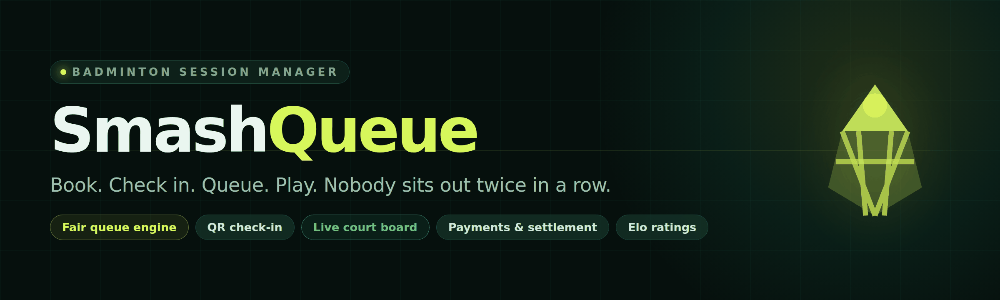

<br>

[](https://github.com/nishadsukumaran/smash-queue/releases)
[](https://smashq.aiopsgroup.ai)
[](#prove-it-yourself)
[](#the-queue-engine)
[](LICENSE)

[](https://nextjs.org)
[](https://react.dev)
[](https://www.typescriptlang.org)
[](https://tailwindcss.com)
[](https://orm.drizzle.team)
[](https://neon.tech)
[](https://vercel.com)

**SmashQ — a mobile-first badminton app for real communities.**<br>
Accounts for every player, communities their owners actually own, fair rotation across courts,<br>
QR check-in, push notifications, payments, and a session summary that tells you whether<br>
the night was actually fair — not just whether it felt fair.

<sub>Built by **[AIOps](https://aiops.ae)** · support **hello@aiops.ae** · built to PRD v1.0</sub>

</div>

---

## The problem, in one line

One person with a whiteboard decides who plays next, and by 9pm half the hall thinks they
have been skipped. SmashQ (Smash Queue) replaces the whiteboard with a queue engine that can be
audited, and gives everyone a phone screen that answers *"when am I next?"* without asking.

<table>
<tr>
<td width="33%" valign="top">

### 🏸 For players
Sign in once with a 4-digit email code, then just a PIN. Book, scan the QR at the door, and
your phone shows games played, minutes waiting and your place in the queue, and buzzes
when you're up.

</td>
<td width="33%" valign="top">

### 📋 For coordinators
One screen. Each open court shows four players already split into teams, with a plain-English
line explaining why. Start. Finish. Next.

</td>
<td width="33%" valign="top">

### 💰 For owners and organizers
Your community is yours: members, sessions, venues, fees, invitations. Expected vs collected
vs outstanding, settled before everyone leaves. The platform can't see in or take over.

</td>
</tr>
</table>

---

## New in v1.1

| | |
| :--- | :--- |
| 🎨 **New brand** | The Shuttle Q mark and SmashQ wordmark, in the app and as a full kit in [`docs/brand`](docs/brand) |
| 👤 **Accounts for everyone** | Any player registers with an email code; every account gets a player number (#1001 on) and a phone PIN |
| 🏘️ **Owner-run communities** | Your first community is created the moment you ask for it — a second one goes to the platform for approval. Public or private, open, approval or invite-only |
| 🔔 **Push notifications** | Put on court, waitlist spot, community notices, invitations, and a reminder on the day. One tap to switch on |
| 🔑 **Short codes, safely** | 4-digit sign-in codes and 4-character invite codes, with daily and hourly guess limits behind them |
| 🛡️ **PIN control** | Owners can switch the shared coordinator PIN off; ten wrong guesses in an hour lock it |
| 🏠 **New home screen** | Live court card, "you tonight", upcoming sessions, notices and recent fairness at a glance |
| 🐛 **Fixes** | Live board crash, iPhone status-bar overlap in the home-screen app, honest counts for players who leave early |

Full notes: [releases](https://github.com/nishadsukumaran/smash-queue/releases).

---

## See it

<div align="center">

### Coordinator court board — the screen the night runs on

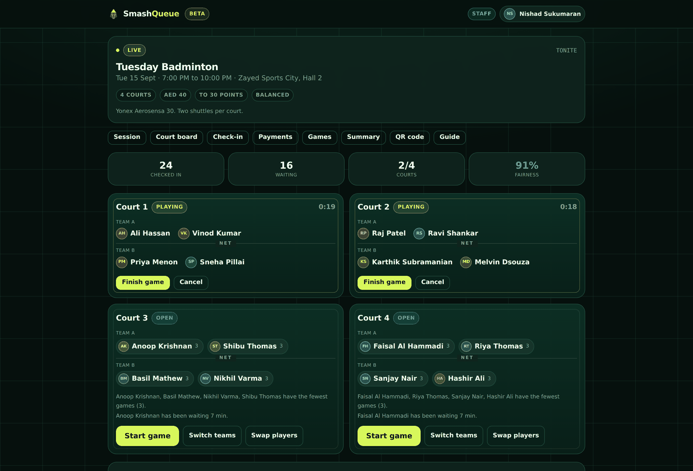

<sub>Two courts in play, two waiting. Each open court shows the engine's pick, the teams, and <i>why</i> — "have the fewest games (3)", "has been waiting 7 min".</sub>

</div>

<table>
<tr>
<td width="50%" valign="top" align="center">

**Player status — mobile first**

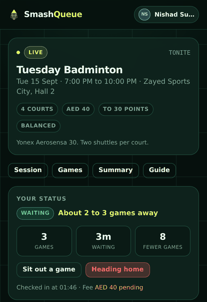

<sub>Games, wait, position, and a buzz when you're up.</sub>

</td>
<td width="50%" valign="top" align="center">

**Session summary — was it fair?**

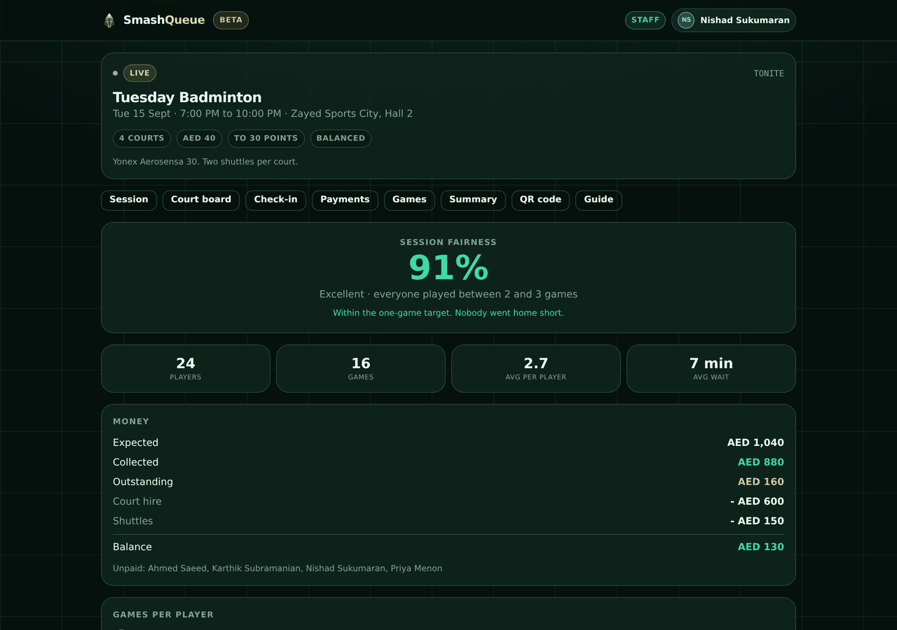

<sub>A single fairness number, plus the money reconciled.</sub>

</td>
</tr>
<tr>
<td width="50%" valign="top" align="center">

**QR check-in**

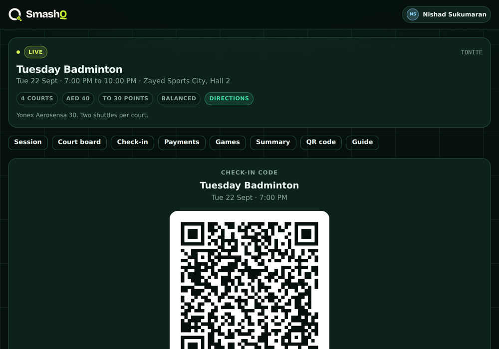

<sub>HMAC-signed, session-scoped, 24-hour expiry.</sub>

</td>
<td width="50%" valign="top" align="center">

**Payments &amp; settlement**

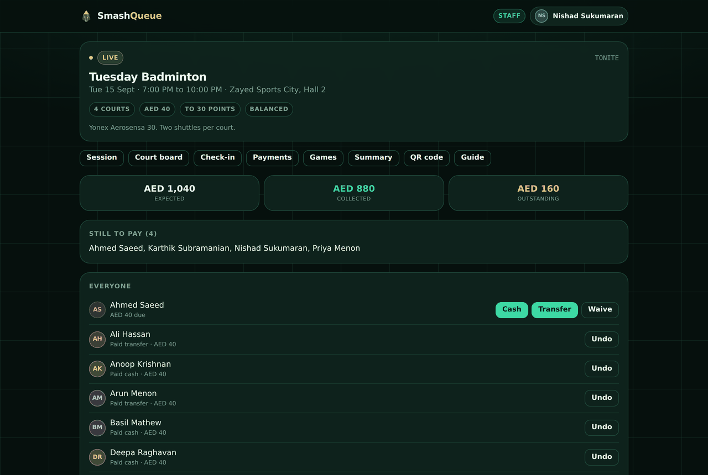

<sub>Cash, transfer or waive. One tap, undoable.</sub>

</td>
</tr>
<tr>
<td width="50%" valign="top" align="center">

**Your profile — every community in one place**

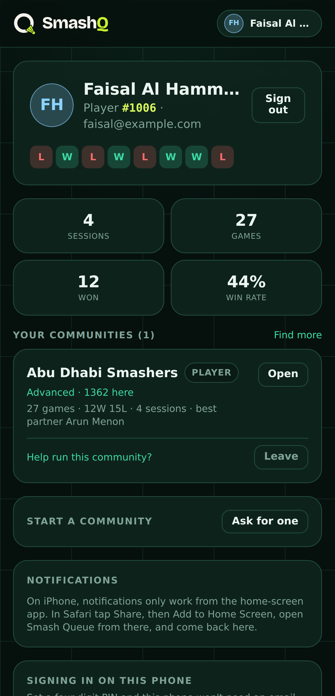

<sub>Player number, form, per-community rating, notifications.</sub>

</td>
<td width="50%" valign="top" align="center">

**Communities — find one, or join with a code**

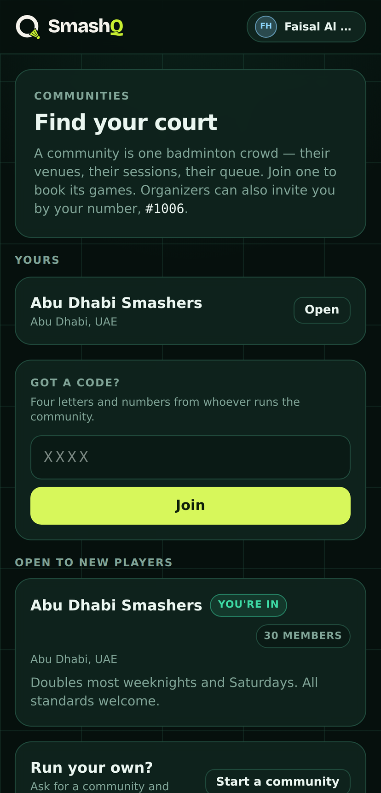

<sub>Public communities, the 4-character code box, and "start your own".</sub>

</td>
</tr>
</table>

<details>
<summary><b>More screens</b> — home, platform console and the in-app guide</summary>
<br>

| Home | Platform console |
| :---: | :---: |
| 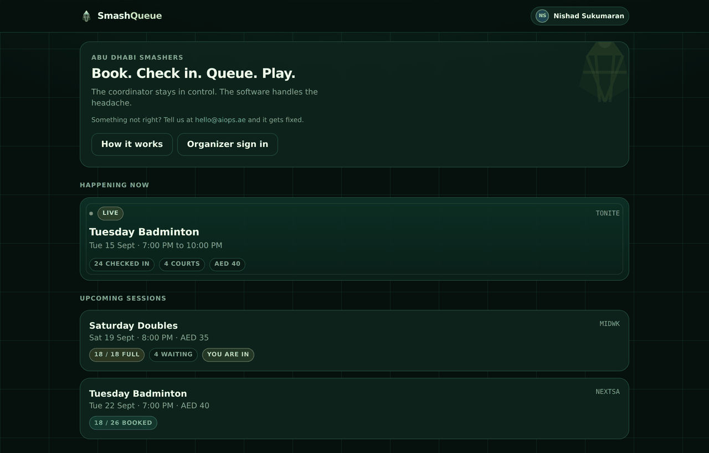 | 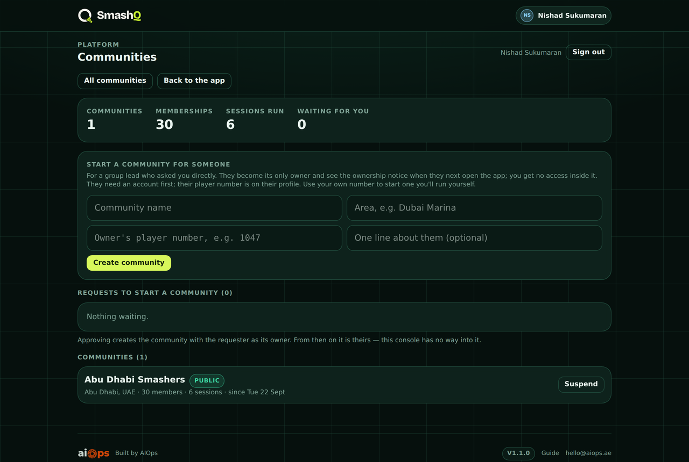 |
| Live court card, you tonight, upcoming, notices | Approve or start communities. Counts only, no way inside |

| In-app user guide |
| :---: |
| 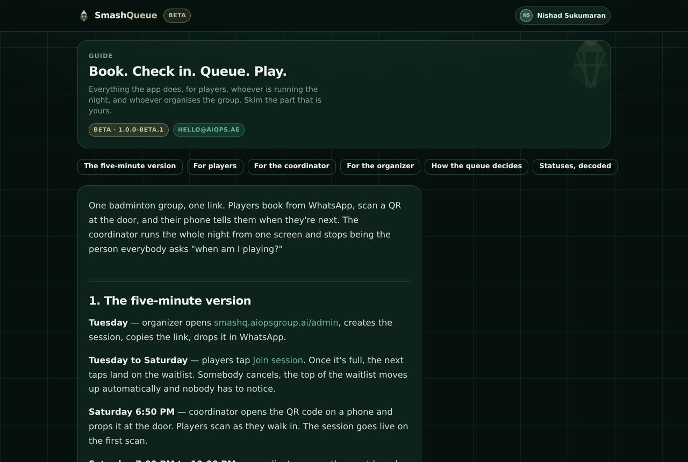 |
| The full guide ships inside the app at `/guide` |

</details>

---

## How a night actually runs

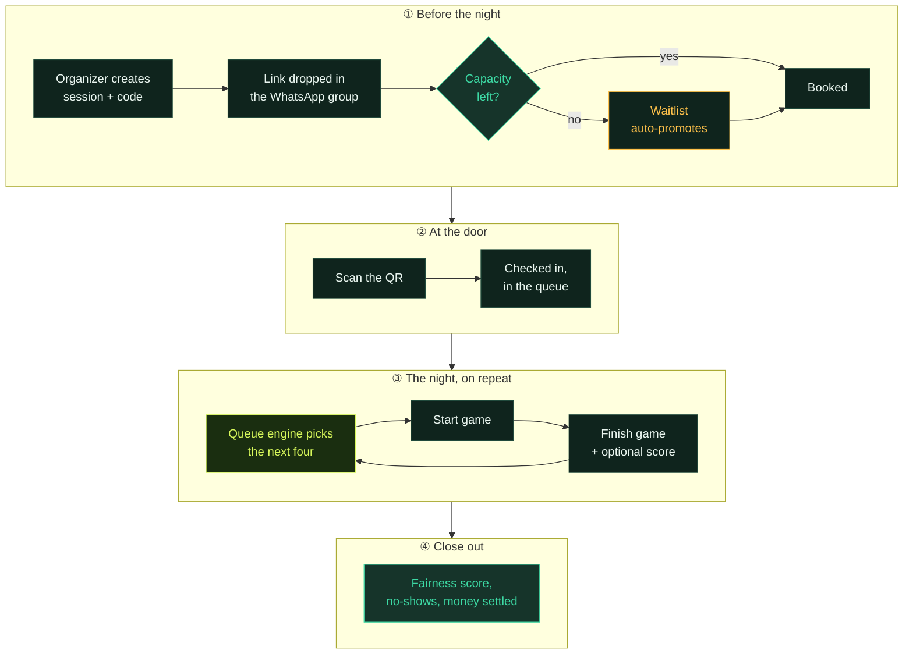

---

## Run it locally

> **Requirements** · Node 22+ (tested on 22 and 26) · a Postgres connection string.
> Neon's free tier is the path of least resistance, and a dev branch keeps your work off
> production data.

```bash
npm install
cp .env.example .env.local     # set DATABASE_URL
npm run setup                  # push the schema, then seed demo data
npm run dev                    # http://localhost:3000
                               # port busy? PORT=3210 npm run dev
```

`npm run setup` seeds **30 players, 6 sessions and ~160 played games**, so every screen has
something real in it. The demo players have no accounts yet: tap a name at `/who` to act as
one, or sign in at `/signin` with any address to register a new player.

For the organizer screens, go to `/signin` as `organizer@example.com`. Without a
`RESEND_API_KEY` the development build prints the code and link straight onto the page, so
a fresh clone gets in before any mail provider exists. The production build refuses to
pretend it sent something.

### Where to look first

| Screen | Path | What you'll see |
| :--- | :--- | :--- |
| 🔴 Live session | `/s/TONITE` | Mid-flight, 24 checked in, courts running |
| 📋 Coordinator board | `/s/TONITE/board` | The engine's picks with reasoning |
| 📅 Open for booking | `/s/NEXTSA` | Booking and cancellation flow |
| ⏳ Full session | `/s/MIDWK` | Waitlist with automatic promotion |
| ⚙️ Organizer | `/admin` | Sessions, members, venues, money |
| 📖 User guide | `/guide` | The non-technical guide, in-app |
| 🔐 Staff sign-in | `/signin` | Emails a code and a link |
| 🏘️ Communities | `/communities` | Directory, join with a code, start your own |
| 👤 Your profile | `/me` | Player number, communities, PIN, notifications |
| 🛰️ Platform | `/hq` | Community requests and totals (demo organizer is platform admin) |
| 🔑 **Staff PIN** | — | **`1234`** (demo seed only) |
| ✉️ **Demo organizer** | — | **`organizer@example.com`** — with no mail provider set, dev prints the code on screen |

### Commands

| Command | What it does |
| :--- | :--- |
| `npm run dev` | Dev server, rebuilds the in-app guide first |
| `npm run setup` | `db:migrate` + `db:seed` — schema then demo data |
| `npm run db:migrate` | Apply pending migrations. Baselines a database built by the old `db:push` |
| `npm run db:generate` | Diff the schema into a new migration — review the SQL before running it |
| `npm run db:reset` | Wipe and reseed when the demo gets messy |
| `npm run db:bootstrap` | **Real** group: one group, one venue, one organizer, no demo data |
| `npm run db:grant-admin` | Give a player staff rights, or a second sign-in address |
| `npm test` | 38 unit tests |
| `npm run sim` | Five session shapes × five runs, reports fairness |

---

## The queue engine

`src/lib/queue-engine.ts` — no database, no framework, pure functions. Which is why it can be
tested properly, and why a whole three-hour session simulates in milliseconds.

> ### Fairness is structural, not a weight.
>
> Players are banded by games played. The engine walks the bands from fewest games upward:
> every band it can take whole, it takes whole. Only the band where it runs out of slots
> becomes a real choice — and inside that band everyone has played the same number of games,
> so waiting time, rest, pairing history and team balance decide freely, without anyone
> jumping the queue.

That distinction is the whole thing. In the first draft fairness was a 50% weight competing
with team balance, and the simulator showed games-per-player drifting to a **spread of four**
over three hours. Making it a band walk instead pinned it at **one**.

Within a band, the ranking follows the PRD's priority list:

| Priority | Weight | What it does |
| :--- | :---: | :--- |
| **Games played** | `50` | Banding above; also breaks ties |
| **Waiting time** | `30` | Longest wait in the pool scores 1.0 |
| **Rest** | `15` | Back-to-back games decay; 4-minute breather after walking off court |
| **Partner / opponent diversity** | `5` | Avoids the same four, weighted by recency |
| **Team balance** | *per game type* | Splits the four into the evenest two pairs |

Weights live on the session row and are editable per session. Game types only change how hard
balance and mixing push:

| Game type | Balance weight | Feels like |
| :--- | :---: | :--- |
| `social` | `5` | Mix everyone, ignore strength |
| `casual` | `20` | Light balancing |
| `balanced` | `60` | Default — even games, still mixes |
| `competitive` | `100` | Closest possible match-ups |

**Coordinator preferences** — *put these two together*, *keep these two apart* — are
session-scoped and honoured as far as they can be without breaking fairness. If a "keep apart"
makes a game impossible to field, the engine relaxes it rather than leaving a court empty,
and flags that it did.

### Prove it yourself

```bash
npm test    # 38 unit tests: priorities, banding, constraints, Elo, QR signing
npm run sim # five session shapes x five runs
```

Current simulator output:

| Scenario | Spread | Fairness | Avg wait | Verdict |
| :--- | :---: | :---: | :---: | :---: |
| 24 players, 4 courts, 3 hours | `1` | 91–94% | 6.9 min | ✅ |
| 28 players, 4 courts, 3 hours | `1` | 92–100% | 10.3 min | ✅ |
| 20 players, 3 courts, 2 hours | `2` | 80–100% | 8.7 min | ✅ |
| 13 players, 3 courts, 2 hours | `1` | 91% | 1.1 min | ✅ |
| 26 players, 6 arriving 30–70 min late | `3` | 63–79% | 7.1 min | ✅ |

The PRD's success metric is a spread of **≤ 1 game**. Two scenarios carry a looser limit and
say why: a two-hour session can land one extra game on the final rotation, and somebody
walking in 70 minutes late genuinely cannot catch up — the engine closes the gap as far as
the clock allows and no further.

---

## What's in the box

Everything in PRD §31 (MVP scope):

| Area | Shipped |
| :--- | :--- |
| **Accounts** | Email code or link to register, player numbers, phone PIN, several sign-in addresses per person, name lock once registered |
| **Communities** | Many per deployment, owner-run, public or private, join policies, invitations by number, email or link, per-community ratings |
| **Access** | Roles from membership only. Session PIN for the court board, owner can switch it off |
| **Sessions** | Shareable code, courts, capacity, fee, notes, game type, per-session weights |
| **Booking** | Book, cancel, capacity limit, waitlist with automatic promotion and renumbering |
| **Check-in** | Signed QR (24h expiry, session-scoped), plus manual and walk-in |
| **Queue** | Multiple courts, live pool, games-played and waiting-time tracking |
| **Matchmaking** | Automatic recommendation, assisted and manual override, every mode tracked |
| **Games** | Start, finish, optional score, optional player confirmation |
| **Money** | Cash / transfer / waive, payment dashboard, session costs, revenue vs cost |
| **Close-out** | No-show marking, session summary, **fairness score** |
| **Stats** | Player history, personal stats, doubles Elo leaderboard |
| **Audit** | Silent coordinator override log |
| **Schema** | Committed migrations, with baselining for databases built before them |
| **Profiles** | Optional gender, birth year, playing level (A to D), nationality, handedness, phone, and a private preferred-partners list. Gender and level required to enter tournaments |
| **Tournaments** | Members-only or public, categories (men/women/mixed, singles/doubles, levels), fees per player or pair, prizes in cash or kind, partner confirmation, gender checks for men's / women's / mixed, entry approval and waitlist, seeding, groups + knockout / knockout / round robin, live results and standings |
| **Notifications** | Web Push: put on court, waitlist spot, notices, invitations, day-of reminder. iPhone needs the home-screen app |
| **Delivery** | Installable PWA, no external CDN or font dependencies |

> **Deliberately Phase 2:** WhatsApp, online payments, tournament mode, recurring sessions.

---

## Communities, owners and accounts

One deployment runs any number of badminton communities. **Each community belongs to its
owner** — its members, sessions, scores and payment records — and nobody outside it,
including the platform, can see in or take it over.

| Role | Scope | Can |
| :--- | :--- | :--- |
| **Platform admin** | The platform (`/hq`) | Decide on requests for a *second* community, or start one directly for a named owner; see totals, suspend one for abuse. **Nothing inside any community** |
| **Owner** (and co-owners) | One community | Everything below, plus: appoint organizers and co-owners, decide visibility, delete the community |
| **Organizer** | One community | Venues, sessions, fees, members, join policy, invitations |
| **Coordinator** | One community | The court board, check-in and payments on the night |
| **Player** | Communities they joined | Book, check in, play; ask to help run it |

Any registered player can **start a community**. The first one is theirs on the spot: nobody
needs to approve a person setting up the group they already run on a Saturday. A second one
is a request the platform admin decides on, which is where somebody minting communities in
bulk meets a human. Either way the person who asked becomes its owner, and is shown an
ownership notice once — accepted and recorded — that spells out what the platform will never
do. The notice is only true because
permissions come from membership alone: there is no platform-admin shortcut anywhere in
`lib/auth`, and the end-to-end suite forges owner-only actions as an organizer and as the
platform admin to prove it.

An owner can delete their community. It vanishes for every member at once, any owner can
restore it for **30 days**, and a daily job (`/api/cron/purge`) then erases it for good.
Registered members keep their accounts.

**Ratings are per community.** A player's rating in one community is built from that
community's games and shown nowhere else. Their own profile is the only place their
communities sit side by side.

Getting into a community:

| Door | Route | Result |
| :--- | :--- | :--- |
| Invitation by player number | in the app, on `/me` | Straight in. Only that player can accept; the inviter is never told whose number it was |
| Invitation by email or link | `/i/<token>` | Straight in. Single-use, 14 days, only the SHA-256 is stored |
| Share link or code | `/join/<CODE>` | Follows the join policy: open, approval or invitation-only |
| Public directory | `/communities` → `/c/<slug>` | For signed-in members; shows when and where it plays, never who |
| QR at the door | `/s/<code>/checkin` | Walk-ins can still be checked in on the night |

## Accounts for everyone

Anyone can register with just an email address: the first code sent to a new address creates
the account. Every account gets a **player number** (1001 onwards) — a name tag for the door
and for invitations, never a key.

On a phone that has proved itself once by email, a **four-digit PIN** unlocks the account from
then on. The PIN is checked only against that phone's own long random device token, both
stored hashed, so it is useless anywhere else; five wrong tries clear it and the phone goes
back to email. Guessable PINs (1111, 1234…) are refused.

Registering on a phone that has been used as an unregistered player **takes that player's
history over** — and the welcome screen says so, with a "that isn't me" that splits it back
apart. Once someone registers, their name is locked: nobody can book, cancel or score as them
by tapping it any more.

Every sign-in email carries **two ways in**: a four-digit code and a clickable link, on the
same token, so using either burns the other. The code is there because a magic link quietly
assumes the browser opening the email is the browser signing in. On a phone it usually
is not — the mail client hands the link to its own in-app browser, the session lands there,
and the tab the person started in is still signed out. A code goes wherever they already
are, and unlike a link it cannot be spent by a mail scanner prefetching it.

Four digits is ten thousand combinations, which is only safe while the number of tries is
small and finite:

| Control | Why it's there |
| :--- | :--- |
| Five wrong guesses destroys the token | Not locks — destroys, so it cannot be ground down |
| Five requests per address per hour | Otherwise you burn five guesses and ask for a fresh code, forever |
| Spent tokens count toward that cap | Failing does not refill the budget |
| Ten wrong codes per address per day | The cap that actually holds: one-in-a-thousand a day, and every request emails the address's owner. The link in the same email keeps working for them |
| Code scoped to the address that asked | An attacker must know whose account they are attacking first |
| Only SHA-256 hashes stored | A dump of the auth tables is inert, links and sessions alike |
| Redirects restricted to same-site paths | Otherwise a link starting on our own domain could bounce a freshly signed-in organizer somewhere else |

Community invite codes are **four characters** (letters and numbers, no I or O), about 1.3
million codes. That's short enough to read out at a venue and far too short to leave open to
a script, so a code only resolves for a signed-in account, and ten wrong codes an hour stops
that account trying.

The sign-in form answers **identically** whether or not an address belongs to anyone,
including when mail is unconfigured — that check runs before the lookup, so it cannot single
out real members either. Say "no such account" and the form becomes a way to test who plays
here.

One person, several addresses: sign-in resolves through `auth_emails`, so a personal and a
work address reach the same account. The alternative — a second user row — is the one
mistake that quietly breaks games played, fairness, Elo and partner history at once, which
is the same failure the duplicate-name guard exists to stop.

---

## Architecture

```
src/
├── db/            schema.ts (26 tables, Drizzle) · migrate.ts · seed.ts
│                  bootstrap.ts · grant-admin.ts
├── lib/
│   ├── queue-engine.ts   the matchmaking engine — pure, no I/O
│   ├── fairness.ts       fairness score + doubles Elo with margin multiplier
│   ├── sim.ts            in-memory session simulator
│   ├── qr.ts             HMAC-signed check-in tokens
│   ├── auth.ts           magic links, one-time codes, sessions, phone PINs
│   ├── tenant.ts         which community you're in, from memberships only
│   ├── push.ts           Web Push, sent after the response
│   ├── rate.ts           guess limits for short codes
│   ├── mail.ts           the one outbound email
│   ├── identity.ts       cookie identity + staff PIN
│   ├── safe-next.ts      redirect allow-list
│   └── origin.ts         request-derived base URL, so QR follows the domain
├── server/
│   ├── queries.ts        read models
│   ├── actions.ts        typed server actions
│   ├── form-actions.ts   FormData wrappers — every form works without JS
│   └── auth-actions.ts   sign in, sign out — kept apart to stay auditable
├── components/    shared UI
├── drizzle/       committed migrations
├── fonts/         the wordmark face (Bricolage Grotesque, OFL)
└── app/           29 routes
```

| Layer | Choice | Why |
| :--- | :--- | :--- |
| Framework | **Next.js 16** App Router, React 19 | Server actions from plain `<form>` — works on one bar of signal |
| Language | **TypeScript** strict | The queue engine is the product; types are cheap insurance |
| Styling | **Tailwind v4** CSS-first `@theme` | No config file, no runtime, no CDN |
| Data | **Drizzle ORM** → **Neon Postgres** | HTTP driver — no connection pool to exhaust from serverless |
| Hosting | **Vercel**, region `fra1` | Co-located with the Neon Frankfurt primary |
| Auth | **Magic link + 4-digit code**, Resend | No passwords to store, leak or reset. The code exists because mail apps open links in their own browser |
| Realtime | Polling, 5–6 s, plus **Web Push** (VAPID) | The board polls; the moments that matter reach the phone in the pocket |

Every mutation is a server action posted from a plain `<form>`, so the app keeps working on a
phone with one bar of signal in a sports hall.

---

## Environment

| Variable | Default | Notes |
| :--- | :--- | :--- |
| `DATABASE_URL` | — | Neon Postgres connection string. **Required** |
| `QR_SECRET` | dev fallback | ⚠️ **Set this before sharing a real session** |
| `RESEND_API_KEY` | none | Sends sign-in codes. Without it, dev prints them; production says so rather than pretending |
| `MAIL_FROM` | Resend sandbox | `Smash Queue <noreply@yourdomain>`, on a domain Resend has verified |
| `OWNER_EMAIL` | — | `db:bootstrap` only. How the first organizer signs in, so it is required there |
| `CRON_SECRET` | none | Lets Vercel's scheduler run the daily purge of deleted communities and the morning session reminders. Without it neither runs |
| `NEXT_PUBLIC_VAPID_PUBLIC_KEY` | none | Push notifications. Pair with `VAPID_PRIVATE_KEY`; generate both once with `npx web-push generate-vapid-keys`. Without them the Notifications switch says they're off for this deployment |
| `VAPID_PRIVATE_KEY` | none | Secret half of the pair. Changing the pair silently orphans every phone's subscription, so set it once |
| `VAPID_SUBJECT` | `mailto:hello@aiops.ae` | Contact the push services use if something goes wrong |
| `PLATFORM_ADMINS` | none | Comma-separated sign-in addresses promoted to platform admin on their next sign-in. Written through to the database, so it can be removed afterwards |
| `APP_BASE_URL` | derived from request | Optional. QR codes normally follow the domain they're served from |
| `NEXT_PUBLIC_TIME_ZONE` | `Asia/Dubai` | Wall-clock times. A UTC server shows Gulf check-ins four hours early without it |
| `PORT` | `3000` | `PORT=3210 npm run dev` when 3000 is taken |

Hosting, schema changes after launch, and what to watch as usage grows: **[`docs/DEPLOYING.md`](docs/DEPLOYING.md)**.
The non-technical guide for players and coordinators: **[`docs/USER-GUIDE.md`](docs/USER-GUIDE.md)** (also live at [`/guide`](https://smashq.aiopsgroup.ai/guide)).

---

## Known limits

Feature-complete against PRD §31, tested, and running in production. What it has not done yet
is thirty people on a Saturday night with patchy venue wifi — so expect the queue weights to
want tuning after the first few real sessions. That is tuning, not repair: the engine's
behaviour is pinned by 38 tests and five simulated session shapes, and a weight change that
widens the games-played spread shows up in the simulator before it reaches a court.

The limits below are real and stated on purpose. None of them block running a night; all of
them are worth knowing before you deploy this for someone else.

| Known limit | Impact | Plan |
| :--- | :--- | :--- |
| Session PIN still opens the court board | A leaked PIN gets a stranger into tonight's board, check-in and payments. It reaches nothing that spans sessions | The owner can switch it off per community; ten wrong guesses in an hour lock it |
| Live screens poll every 5–6 s | Noticeable if you stare at the board, not while running a session | Push covers the moments that matter; the board itself still polls |
| Player score confirmation off by default | In the data model, switched off | Enable per group |
| No interactive transactions over Neon HTTP | Costs nothing today — every write is a single statement | Check before adding a multi-statement atomic write |

**On keeping the PIN.** It would be tidier to delete it, and worse. The realistic
alternative at 7pm in a sports hall on one bar of signal is telling a coordinator to go and
find their email, and a coordinator who cannot start a game runs the night on paper. So the
PIN survives where speed decides the outcome, and reaches nothing else: members, venues,
fees, settings and statistics take an account and ignore it entirely.

An owner who would rather not have a PIN at all switches it off under **Members → Shared
coordinator PIN**. Every phone unlocked with it loses the board on its next load, and
coordinators sign in with their own accounts instead.

Found something wrong, or want a weight changed? **hello@aiops.ae**

---

## Brand

The **Shuttle Q** mark — a Q whose tail is a shuttlecock — with the SmashQ wordmark in
Bricolage Grotesque. Mark variants, app icon, outlined lockups, colours and usage rules live in
[`docs/brand`](docs/brand).

<p align="center"></p>

---

## Using this

Apache License 2.0 — see [`LICENSE`](LICENSE). Use it commercially, fork it, modify
it, run it for your club, build a product on it. No permission needed.

Three conditions come with it:

| You must | Where it's written |
| :--- | :--- |
| Keep the copyright notice, the licence and the [`NOTICE`](NOTICE) file in any copy you distribute | Apache 2.0, §4(a)–(d) |
| Keep the **Built by AIOps** credit visible in the running app | [`NOTICE`](NOTICE), carried by §4(d) |
| State what you changed, if you modified it | Apache 2.0, §4(b) |

The footer credit can be restyled to fit your design. It just has to stay somewhere a
user would actually find it. Everything else Apache 2.0 allows is yours without asking.

Want different terms — white-label, credit removed, something bespoke? That's a
conversation, not a no: **hello@aiops.ae**

### Contributing

Issues and pull requests are welcome. The queue engine is the part that matters, so if
you're changing `src/lib/queue-engine.ts`, run `npm test` and `npm run sim` and put the
simulator output in the PR — a change that widens the games-played spread is a
regression even if every test passes.

---

<div align="center">

<sub>**SmashQ** is built and maintained by **[AIOps](https://aiops.ae)** — vendor-independent
forward deployed engineering for the GCC.<br>
Copyright &copy; 2026 Nishad Sukumaran (AIOps) · Licensed under [Apache 2.0](LICENSE)</sub>

</div>
